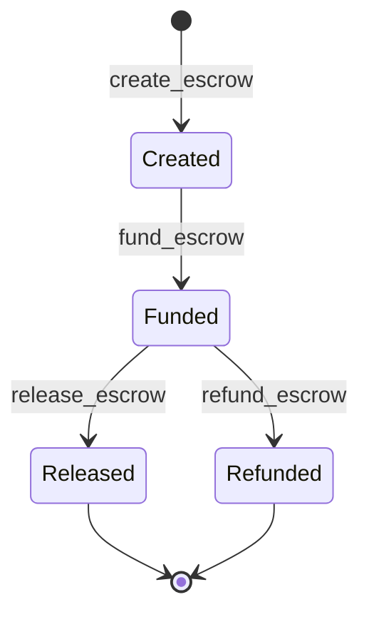
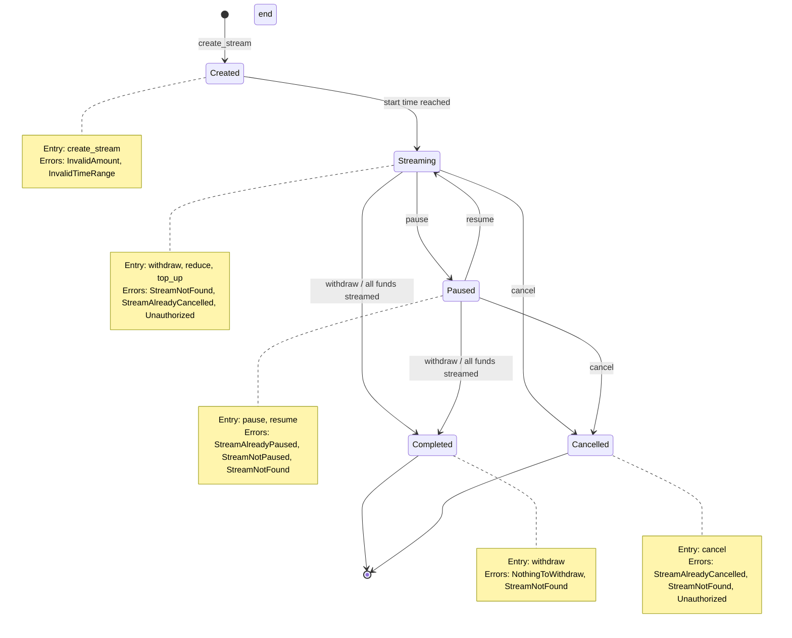

# Contracts Documentation

This document outlines the contracts available in `stellar-streams` and their lifecycles.

## Escrow Contract Lifecycle

```mermaid
stateDiagram-v2
    [*] --> Created: create_escrow
    Created --> Funded: fund_escrow
    Funded --> Released: release_escrow
    Funded --> Refunded: refund_escrow
    Released --> [*]
    Refunded --> [*]
```

## Stream Contract Lifecycle

```mermaid
stateDiagram-v2
    [*] --> Created: create_stream
    Created --> Streaming: start time reached
    Streaming --> Paused: pause
    Paused --> Streaming: resume
    Streaming --> Completed: withdraw / all funds streamed
    Paused --> Completed: withdraw / all funds streamed
    Streaming --> Cancelled: cancel
    Paused --> Cancelled: cancel
    Completed --> [*]
    Cancelled --> [*]

    note right of Created
      Entry: create_stream
      Errors: InvalidAmount, InvalidTimeRange
    end note

    note right of Streaming
      Entry: withdraw, reduce, top_up
      Errors: StreamNotFound, StreamAlreadyCancelled, Unauthorized
    end note

    note right of Paused
      Entry: pause, resume
      Errors: StreamAlreadyPaused, StreamNotPaused, StreamNotFound
    end note

    note right of Completed
      Entry: withdraw
      Errors: NothingToWithdraw, StreamNotFound
    end note

    note right of Cancelled
      Entry: cancel
      Errors: StreamAlreadyCancelled, StreamNotFound, Unauthorized
    end note
end
```
